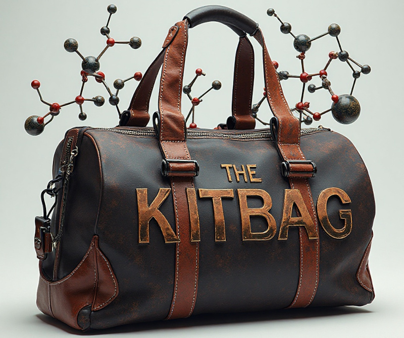

<!--  -->

# The Kitbag
## End-to-end and modular Python pipelines for computational chemistry

Here's where all my end-to-end comp chem software pipelines live. Generally knitting together a bunch of stuff using Python, yamls and workflows. The aim is to make these able to run as independent pipelines or interoperate. Anyone who has ideas for how to best do that, drop me a message.

## How does it work?

At the moment, the pipelines are separately stored and run in `pipelines`. You'll find example workflow and yamls there. I haven't gotten around to putting together a `env.yml` for them, so you'll be chasing Pythong deps for now.

## What does / will it do?

The code is organised into sections that reflect various computational chem software for various computational chem pipelines;

* Data retrieval and curation
    * Retrieve data from public sources (Chembl, Pubchem, etc.)
    * Curate them for further calculations.
    * Smoosh them together for various purposes
* Cheminformatics 
    * Various data-driven use cases for:
        * Hit discovery
        * Lead opt
        * Multi-target
* Docking
    * Modelling
    * Running the docking (Gnina, generally)
    * Post-processing
    * Benchmarking
* MD
    * System prep, setup, run.
    * Post-processing
    * Automated analysis
* Quantum chemistry
    * Setup, structure opt, SP
    * Post-processing
    * Benchmarking

## TODO

* Y'know, build the pipelines.
* GPU code will be used as much as possible, so you'll need CUDA.
* TDD will in-principle be used (this will always be a TODO won't it).
