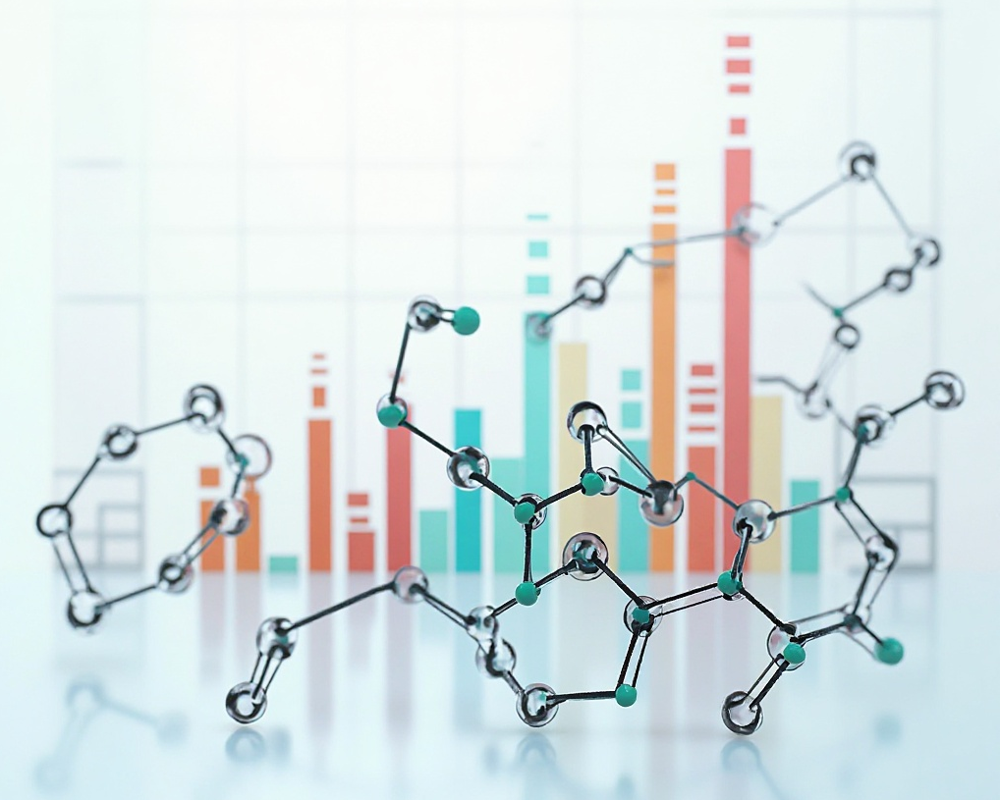

# Cheminformatics pipeline

Perform all sorts of cheminf calculations from basic physchem filtering to more advanced analyses. The overall goal is to squeeze down huge lists of molecules from data extraction to something more manageable and representative for virtual screening.



## Setup and dependencies

* Mainly Python libs
* Rdkit

## Running calculations

I use a yaml/workflow system. Examples for each are in `configs/*yaml` and `workflows/*py`.

See a few workflow runs in `projects/test` Run the code from there with, for example:

`python ../../run_cheminformatics_pipeline.py --params ../../configs/chembl_pipeline_physchem.yaml > log.log`

If the calculation runs correctly, you should see output (`log.log`) and a `output/physchem` directory should appear.

## So what can it do?

`python list_available_tasks_and_workflows.py`

```
Available Tasks:
  [Filtering]:
    - activity_filtering: Filter molecules based on activity cutoff
    - basic_lipinski_filtering: Basic Lipinski Rule of 5 filtering
    - fragment_novelty_filtering: Scaffold-based fragment selection for novelty filtering
    - physchem_filtering: Physchem filtering with mandatory and optional cutoffs + conformer generation
    - toxic_reactive_filtering: Toxic and reactive SMARTS matching for molecules
  [Library generation]:
    - combinatorial_enumerator: Generate combinatorial library from fragments and R-groups.
    - focused_fragment_library_generator: Generate a focused library by fragment frequency.
    - reaction_based_enumeration: Generate library from fragments with reaction SMIRKS/SMARTS.
  [Prediction]:
    - adme_prediction: Predict ADME properties (hERG, LogD, CYP3A4, A->B (Papp)) from SMILES using PyTorch models
Available Workflows:
 - dynamic_task_runner: Run a task list in parallel on input chunks and output CSV/SDF/SMI
```

If you want to register new workflows, you'll also need to do so with metadata to describe what it does.

## TODO

See [issues](https://github.com/coreytaylorcompchem/the_kitbag/issues) for a more complete list.

* More advanced filtering:
  * Shape-based and pharmacophore filtering
  * Tox filters (e.g. PAINS)
  * Clustering/PCA
  * Fragment/scaffold filtering
* More advanced analyses
  * MMPs
  * SAR analyses
  * Scaffold analyses and scaffold hops
  * Use of ML models for ADME prediction
  * Free-Wilson analysis
* Structural
  * Protein and ligand conformational analyses
  * Loop modelling
  * Pocket characterisation