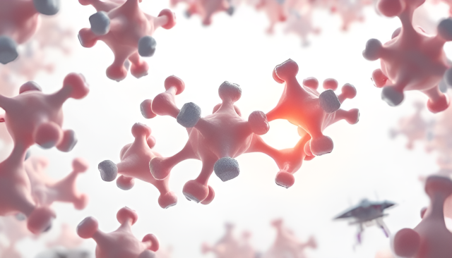

# Docking pipeline



In this repo are workflows to dock compounds with various use cases (unbiased, constrained core, etc.). 

## Setup and dependencies

* [gnina](https://github.com/gnina/)
* [Unidock](https://github.com/dptech-corp/Uni-Dock)
* [propka](https://propka.readthedocs.io/en/latest/)
* [xtb](https://xtb-docs.readthedocs.io/en/latest/setup.html)
* [fpocket](https://github.com/Discngine/fpocket)
* Most Python libs.

## Running calculations

I use a yaml/workflow system. Examples for each are in `configs/*yaml` and `workflows/*py`.

See a few workflow runs in `projects/test` Run the code from there with, for example:

`python run_data_pipeline --params ../../configs/vanilla_docking.yaml > log.log`

If the calculation runs correctly, you should see output (`log.log`) and a `output/` directory should appear.

## So what can it do?

`python list_available_tasks_and_workflows.py`

```
Available Tasks:
  [Docking]:
    - dock: Dock with backend specified.
       ↳ Backends: gnina, unidock
  [Ligand preparation]:
    - cluster_conformers: Cluster conformers by specified energy and RMSD criteria.
       ↳ Backends: gnina, unidock
    - convert_to_pdbqt: Convert ligands to pdbqt for docking.
       ↳ Backends: gnina, unidock
    - generate_conformers: Generate multiple feasible conformers from ligands.
       ↳ Backends: gnina, unidock
    - save_final_conformers: Save conformers that meet energy and RMSD criteria.
       ↳ Backends: gnina, unidock
    - standardise_ligand: Prepare and generate 3D coords for each ligand.
       ↳ Backends: gnina, unidock
  [Receptor preparation]:
    - prepare_receptor_pdbqt: Prepare the receptor for docking. Format: pdbqt
       ↳ Backends: gnina, unidock
Available Workflows:
 - constrained_docking: Prepare, dock and score with core constraints (WIP - may remove).
 - multi_pocket_docking: Dock ligands into top N pockets detected by fpocket.
 - multi_structure_docking: Dock ligands into multiple PDB structures using known ligand positions.
 - vanilla_docking: Prepare, dock and score with no constraints.
```

If you want to register new workflows, you'll also need to do so with metadata to describe what it does.

## TODO

See [issues](https://github.com/coreytaylorcompchem/the_kitbag/issues) for a more complete list.

* Add ML-based docking backends like [Diffdock](https://github.com/gcorso/DiffDock) and [Equibind](https://github.com/HannesStark/EquiBind).
* Add other docking modes (constrained core, ensemble, etc.)
* Run docking on multiple targets. 