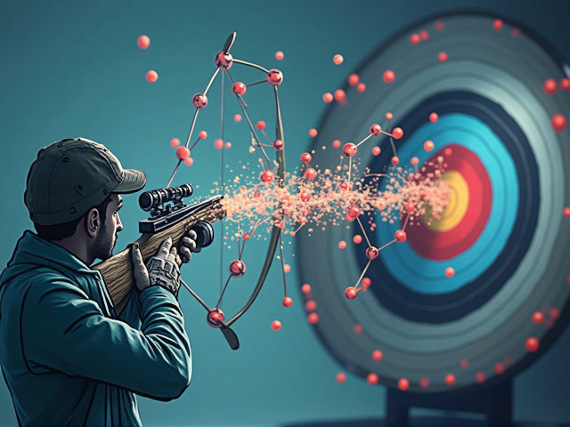

# Machine learning pipeline



In this repo are workflows to train various useful data-driven models for affinity, ADME and others for use in virtual screening workflows. 

## Setup and dependencies

* [Rdkit](https://www.rdkit.org/docs/Install.html)
* [Cuda](https://developer.nvidia.com/cuda-toolkit)
* [Pytorch](https://pytorch.org/get-started/locally/)
* [Pytorch geometric](https://pytorch-geometric.readthedocs.io/en/2.4.0/install/installation.html)
* [sklearn](https://scikit-learn.org/stable/install.html)
* [MDAnalysis](https://www.mdanalysis.org/pages/installation_quick_start/)
* [mdakit-sasa](https://mdakits.mdanalysis.org/mdakit-sasa.html) - see all [mdakits](https://mdakits.mdanalysis.org/mdakits.html) as we'll likely need others eventually.
* Many other common Python libs (NumPy, Pandas, etc.).

See `environment.yml` for the rest. The list is indicative only, as this repo is under development.

## Running calculations

I use a yaml/workflow system. Examples for each are in `configs/*yaml` and `workflows/*py`.

See a few workflow runs in `projects/test` Run the code from there with, for example:

`python run_machine_learning_pipeline --params ../../configs/train_pose_ranker.yaml > log.log`

If the calculation runs correctly, you should see output (`log.log`) and a `output/` directory should appear.

## So what can it do?

`python list_available_tasks_and_workflows.py`

```
Available Tasks:
  [Molecular generation]:
    - build_model: 
    - evaluate_molecular_generation: Plot training history and evaluation metrics.
    - load_preprocess_standardise_data: 
    - split_and_create_dataloaders: Create train/val dataloaders for SMILES transformer training.
    - train_molecular_generation: Train SMILES Transformer model.
  [Pose ranker]:
    - evaluate_model: Evaluate trained model stats and plots.
    - load_model_spec: Load Pose Ranker model spec.
    - load_targets_prepare_graphs: Load MD trajs and parameterise as graphs.
    - prepare_dataloaders: Normalise labels and create train/val DataLoaders
    - train_pose_ranker: Train Pose Ranker model with grid search.
Available Workflows:
 - train_model: Train and evaluate specified model
```

If you want to register new workflows, you'll also need to do so with metadata to describe what it does.

## TODO

See [issues](https://github.com/coreytaylorcompchem/the_kitbag/issues) for a more complete list.

* Add various ML models for training:
   * ADME models (hERG, LogD, met stab, etc.)
   * Single-task affinity models (pIC50). 
   * MTLs for within-family selectivity. 
   * Reactivity prediction
* Deployment routines.
  * Feed in docked structures from docking pipeline for pose evaluation.