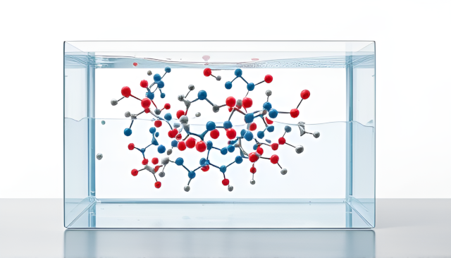

# Molecular dynamics pipeline

Perform different types of MD in automated, end-to-end fashion. 



## Setup and dependencies

* Mainly Python libs
* [Cuda](https://developer.nvidia.com/cuda-toolkit)
* [Rdkit](https://www.rdkit.org/docs/Install.html)
* [OpenMM](https://docs.openmm.org/latest/userguide/application/01_getting_started.html)
* [PDBFixer](https://github.com/openmm/pdbfixer)
* [Biopython](https://biopython.org/) (may remove this)

## Running calculations

I use a yaml/workflow system. Examples for each are in `configs/*yaml` and `workflows/*py`.

See a few workflow runs in `projects/test` Run the code from there with, for example:

`python ../../md_pipeline.py --params ../../configs/md.yaml`

If the calculation runs correctly, you should see outputs like logs, trajectories, etc. appear.

## So what can it do?

`python list_available_tasks_and_workflows.py`

```
Available Tasks:
  [Analyses]:
    - solvent_hbonds: Compute direct and water-mediated hydrogen bonds.
       ↳ Backends: openmm
  [Molecular dynamics]:
    - heat_and_equilibrate: Heating and equilibration.
       ↳ Backends: openmm
    - minimize: Initial energy minimization.
       ↳ Backends: openmm
    - prepare_system: Load inputs, cap chains, parameterise ligand and protein, solvate and save final topology.
       ↳ Backends: openmm
    - production: Run production simulation.
       ↳ Backends: openmm
    - setup_simulation: Set up integrator and simulation.
       ↳ Backends: openmm
Available Workflows:
 - molecular_dynamics: Perform molecular dynamics simulation using OpenMM.
```

If you want to register new workflows, you'll also need to do so with metadata to describe what it does.

## TODO

See [issues](https://github.com/coreytaylorcompchem/the_kitbag/issues) for a more complete list.

* More options for MD simulations.
    * Different constraints (harmonic, restraints, etc.)
    * Control outputs.
    * Restarts.
    * Classic and ML force fields.
    * Loop modelling.
* Automated analyses.
    * Basic trajectory analysis (RMSD/F, hbonds, torsions, solvent lifetimes, etc.)
    * Advanced trajectory anlyses (PCA, water analyses, graph-based workflows). 
* More advanced simulation types.
    * QMMM.
    * Steered MD.
    * Metadynamics.