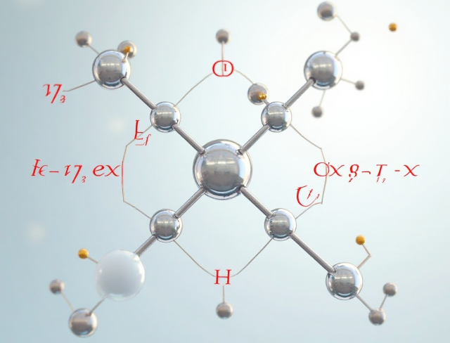

# Quantum chemistry pipeline

Here's where we can run some quantum chemistry calculations. 



## Setup and dependencies

You'll need `psi4` and several others. Will create an env.yaml in time. Further explanations on what the other bits do - soon.

## Running calculations

I use a yaml/workflow system. Examples for each are in `configs/*yaml` and `workflows/*py`.

Just to verify all the code and software is running and installed correctly, there's a test run in `projects/test` Run the code from there with:

`python ../../run_qchem_pipeline --params ../../configs/pipeline_single_stage.yaml > log.log`

If the calculation runs correctly, you should see output (`log.log`) and a `results` directory appear.

## So what can it do?

The code is implemented with automatic checkers to see what's actually available. Run `python list_available_tasks_and workflows.py` for a list.

```
Available Tasks:
  [EDA]:
    - qtaim: Do AIM (Atoms In Molecules) analysis (WIP).
    - sapt0: Do a sapt0 calculation (WIP)
  [Energy]:
    - single_point: Performs a single-point energy calculation using the selected backend.
  [Optimization]:
    - optimise: Performs geometry optimization using the selected backend.
  [PES exploration]:
    - torsion_scan: Do a torsion scan of a bond (WIP).
  [Property]:
    - calc_pka: Calculate site pKa values from HA/A- free energies (WIP).
    - mesp: Calculates Molecular Electrostatic Potential (MESP) and outputs cube files for visualization (WIP).
    - site_pka: Enumerate acidic sites, generate protonated and deprotonated geometries for pKa calculations (WIP).

Available Workflows:
 - staged_workflow: Performs single or multi-stage calculations.
```

If you want to register new workflows, you'll also need to do so with metadata to describe what it does.

## TODO

* Implement XTB and Orca API to give further options.
* Add all the common calculations (torsion scans, mesp maps, etc.)
