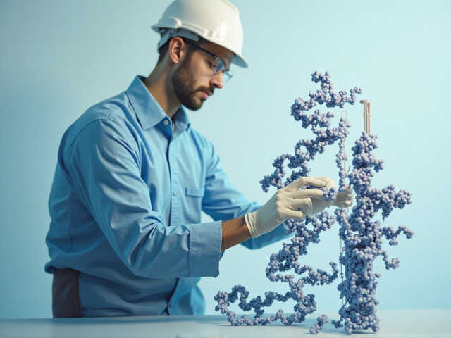

# Structural modelling pipeline

Modelling of proteins and peptide.



## Setup and dependencies

* [Rdkit](https://www.rdkit.org/docs/Install.html)
* [PyRosetta](https://www.pyrosetta.org/downloads) 
  * NOTE: 1.7 Gb download
* [Biopython](https://biopython.org/wiki/Download)
* [ColabFold](https://github.com/sokrypton/ColabFold)
* [OpenMM](https://docs.openmm.org/latest/userguide/application/01_getting_started.html)

## Running calculations

I use a yaml/workflow system. Examples for each are in `configs/*yaml` and `workflows/*py`.

See a few workflow runs in `projects/test` Run the code from there with, for example:

`python ../../run_structure_modelling_pipeline.py --params ../../configs/aaa.yaml > log.log`

If the calculation runs correctly, you should see output (`log.log`) and a `output/physchem` directory should appear.

## So what can it do?

`python list_available_tasks_and_workflows.py`

```
Available Tasks:
  [Peptide modeling]:
    - build_peptide_batch: Predict structures for multiple peptides using ColabFold
    - minimize_peptide_batch: Minimize peptide structures using OpenMM with optional implicit solvation
  [Protein modelling]:
    - cap_terminals: Add ACE/NME caps to terminal residues
    - fix_loops: Model missing loops.
    - fix_residues: Fix incomplete residues
    - refine_loops: Refine loops.

Available Workflows:
 - protein_modelling: Fix, model, and refine protein structure.
```

If you want to register new workflows, you'll also need to do so with metadata to describe what it does.

## TODO

See [issues](https://github.com/coreytaylorcompchem/the_kitbag/issues) for a more complete list.

* Model membrane proteins + membrane.